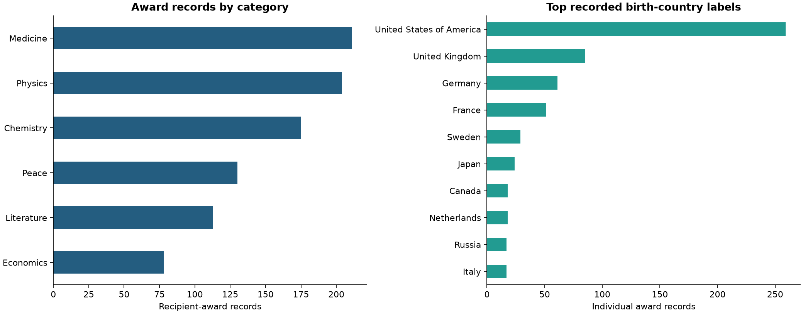
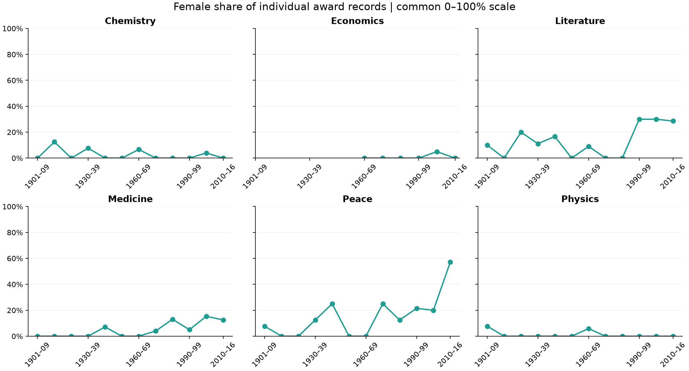

# Nobel Prize Analysis | 1901–2016

[](https://github.com/1hugemtf/nobel-prize-analysis/actions/workflows/validate.yml)

**A reproducible study of award records, representation, repeat laureates and approximate award age.**

[Read the executed notebook](notebook.ipynb) · [Open in Colab](https://colab.research.google.com/github/1hugemtf/nobel-prize-analysis/blob/main/notebook.ipynb)



## What the data actually counts

| Measure | Result |
|---|---:|
| Recipient-award records | 911 |
| Distinct year/category awards | 579 |
| Unique laureate IDs, all types | 904 |
| Individual award records, after documented corrections | 885 |
| Unique individuals | 881 |
| Organization award records | 26 |
| Female-labelled individual award records | 49 of 885 (5.5%) |
| Individual records with usable birth dates | 883 of 885 |

A shared award produces several rows; a repeat laureate appears more than once. The charts count award records, not prize-share-weighted totals or unique people. Prize fractions are separately checked to sum to one for all 579 year/category awards.

## Questions explored

- Which categories and recorded birth countries appear most often?
- How does US-born representation change across decades?
- How does female representation vary across categories and time?
- Which laureate IDs receive multiple awards?
- How does approximate age at the award year differ by category?



## Findings within the 1901–2016 snapshot

- The United States of America is the most frequent recorded birth-country label: 259 individual award records. Birthplace is not nationality or citizenship.
- The first female award record is Marie Curie in Physics, 1903.
- Six laureate IDs repeat. The International Committee of the Red Cross has three records in this snapshot; the original exercise incorrectly described two.
- The youngest and oldest approximate award ages in this archive are Malala Yousafzai (17, 2014) and Leonid Hurwicz (90, 2007). These are year-minus-birth-year values, not exact ceremony-date ages or current all-time records.

## Source errors corrected transparently

The original CSV labels four people as organizations. The notebook corrects only their analysis-time recipient type, keeps a `source_laureate_type` column, and leaves the original CSV unchanged. Corrections are keyed by stable laureate ID and supported by official pages:

| ID | Laureate | Reference |
|---|---|---|
| 531 | Le Duc Tho | [NobelPrize.org](https://www.nobelprize.org/laureate/531) |
| 540 | Mother Teresa | [NobelPrize.org](https://www.nobelprize.org/prizes/peace/1979/summary/) |
| 551 | The 14th Dalai Lama | [NobelPrize.org](https://www.nobelprize.org/laureate/551) |
| 553 | Aung San Suu Kyi | [NobelPrize.org](https://www.nobelprize.org/laureate/553) |

No sex, nationality or identity is inferred. Award records may include declined awards; they do not establish acceptance or ceremony attendance.

## Method and limitations

Individual-only representation charts use explicit eligible denominators. Missing birthplace and sex values are excluded from the corresponding proportions, rather than treated as a different group. Every denominator is displayed in the notebook. Historical birth-country labels and supplied Female/Male categories are retained.

The boundary periods are partial: 1901–1909 and 2010–2016. Category periods without eligible records remain missing, not zero. Repeat laureates are grouped by ID instead of name.

Approximate age is award year minus birth year and may be one year higher than age on a particular date. Two missing birth dates are excluded only from age analysis. Category charts show observations and decade medians on shared axes; no forecast is fitted.

This descriptive dataset cannot establish whether award selection is fair or explain disparities. It lacks nomination/applicant denominators and wider career context. All findings stop at 2016. Some source names contain encoding artifacts; they are preserved rather than guessed.

## Run locally

Use Python 3.12:

```bash
git clone https://github.com/1hugemtf/nobel-prize-analysis.git
cd nobel-prize-analysis
python -m venv .venv
```

Activate on Windows PowerShell:

```powershell
.venv\Scripts\Activate.ps1
```

Or on macOS/Linux:

```bash
source .venv/bin/activate
```

Install and open:

```bash
python -m pip install -r requirements.txt
python -m jupyterlab notebook.ipynb
```

Select **Restart Kernel and Run All Cells**. The notebook reads `datasets/nobel.csv` and exports four PNGs. No live data or remote images are needed. For Colab, upload `nobel.csv` into a `datasets` folder first. Colab is optional; the pinned Python 3.12 environment is the automated test target.

## Automated checks

```bash
python -m pip check
python validate_notebook.py
```

Validation clears saved outputs and executes every cell in a fresh kernel. Checks cover counting units, unique award keys, the four source corrections, prize-share sums, representation denominators, repeat IDs, approximate ages, known snapshot results and chart exports. GitHub Actions runs the same checks on pushes and pull requests, then saves the executed notebook and charts as a downloadable artifact.

## Files

- `notebook.ipynb`: executed analysis, tables, charts and interpretation.
- `datasets/nobel.csv`: unchanged original dataset.
- `awards_and_birth_countries.png`, `us_born_share.png`, `female_representation.png`, `award_age_by_category.png`: chart exports.
- `validate_notebook.py`, `requirements.txt`, `.github/workflows/validate.yml`: reproducibility and validation.

## Attribution

Adapted from the supplied DataCamp Nobel Prize learning project, `workspaceNobelPrizeProject.zip`. Its narrative attributes the source dataset to the Nobel Foundation. This edition revises counting, data auditing, charts and interpretation. Source-data rights remain with their respective owners; no blanket license is asserted over third-party data.

**Hamed Dhiaa** · [Portfolio](https://1huge-dhiaa.carrd.co) · [LinkedIn](https://www.linkedin.com/in/dhiaa-hamed/)
